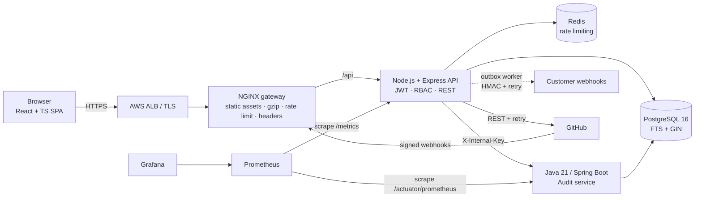

<div align="center">

# TeamFlow CMS
### Enterprise collaboration & content platform — Jira/Confluence-style docs, reviews and repo-linked work


</div>

> **Not another CRUD app.** TeamFlow models how real internal engineering platforms work: *versioned content with optimistic concurrency, a review/approval state machine, signed + retried webhooks, a GitHub integration that links commits and PRs to documents, an append-only audit service in Java, and production-grade delivery with health-gated deploys and automatic rollback.*

---

## Table of contents
[Highlights](#highlights) · [Architecture](#architecture) · [Quick start](#quick-start) · [Feature deep-dive](#feature-deep-dive) · [API](#api-reference) · [RBAC](#rbac-matrix) · [Security](#security) · [Observability](#observability) · [CI/CD & AWS](#cicd--aws) · [Performance](#performance--how-to-measure-it) · [Engineering decisions](#engineering-decisions) · [Roadmap](#roadmap)

## Highlights

| Area | What's implemented |
|---|---|
| **Enterprise CMS** | Documents, immutable version history, restore-as-new-version, Markdown editor + sanitized live preview, `draft → in_review → approved → published` workflow, **PostgreSQL full-text search** (weighted `tsvector` + GIN, ranked, highlighted snippets) |
| **Collaboration** | Comments, `@mentions`, activity feed, document ownership, reviewer-based **approval workflow** bound to a specific version |
| **Security** | JWT auth, **OAuth2 (GitHub)**, **RBAC** (viewer / editor / admin) enforced server-side, bcrypt, AES-256-GCM encrypted integration tokens, HMAC-verified inbound webhooks, Helmet + CSP, **immutable audit log** |
| **Integration layer** | **GitHub integration** (connect repo → import commits/PRs → link to docs, auto-link via `DOC-xxxxxxxx`), inbound signed webhooks, **outbound webhooks** with HMAC signing, **exponential-backoff retries** and idempotency keys, **Idempotency-Key** support on writes, **Redis rate limiting** |
| **Frontend** | React 18 + TypeScript, responsive (mobile → desktop), dark mode, WCAG-minded (skip link, labels, `aria-live`, focus rings, keyboard-operable tabs), explicit loading/error/empty states, ES2019 build target for broad browser support |
| **Production engineering** | Multi-stage Docker builds, non-root containers, NGINX gateway (gzip, caching, security headers, rate limit), GitHub Actions CI + deploy, **health-gated deploys with automatic rollback**, graceful shutdown |
| **Observability** | Prometheus metrics (Node + Spring Actuator/Micrometer), Grafana dashboard provisioned as code, alert rules (availability, 5xx ratio, p95 latency, webhook failures), structured JSON logs with request-id correlation |

## Architecture



**Why two backend runtimes?** The Node API owns the product surface (fast iteration, shared TypeScript types mindset), while the **Java service owns compliance-sensitive, append-only audit data** behind an internal key. It demonstrates polyglot service boundaries, internal auth, and cross-service failure isolation: audit writes are fire-and-forget with timeouts, so an audit outage never takes down the product.

```
teamflow-cms/
├── frontend/         React + TypeScript (Vite)
├── backend/          Node.js + Express API (TypeScript, vitest)
├── audit-service/    Java 21 + Spring Boot 3 audit service (JDBC, Actuator, Micrometer)
├── nginx/            Gateway config + Dockerfile that bundles the built SPA
├── db/init.sql       Schema, indexes, constraints
├── monitoring/       Prometheus, alert rules, Grafana dashboards-as-code
├── scripts/          deploy.sh (health-gated + rollback), k6 load test
├── docs/             AWS deployment guide
└── .github/workflows CI and Deploy pipelines
```

## Quick start

```bash
git clone <your-fork> && cd teamflow-cms
make up                      # builds + starts postgres, redis, audit, api, gateway, prometheus, grafana
make seed N=5000             # demo users + 5,000 documents (for search/load testing)
```

| Service | URL |
|---|---|
| App | http://localhost:8080 |
| Grafana | http://localhost:3001 (admin / `GRAFANA_PASSWORD`) → *TeamFlow — Service Overview* |
| Prometheus | http://localhost:9090 |

Demo logins (password `Passw0rd!`): `admin@teamflow.dev`, `editor@teamflow.dev`, `viewer@teamflow.dev`.

**Local dev without Docker for the apps:** `docker compose up -d postgres redis audit`, then `cd backend && npm i && npm run dev` and `cd frontend && npm i && npm run dev` (Vite proxies `/api` to `:4000`).

## Feature deep-dive

### 1. Enterprise CMS
- **Versioning:** every save inserts an immutable row in `document_versions`. *Restore* never rewrites history — it creates a new version with a "Restored from vN" note.
- **Optimistic concurrency:** `PUT` requires `baseVersion`; a stale editor gets `409 version_conflict` instead of silently overwriting a colleague.
- **Search:** a stored generated `tsvector` (title weight **A**, body weight **B**) with a GIN index; `websearch_to_tsquery` supports quoted phrases and `-exclusions`; results ranked with `ts_rank` and highlighted with `ts_headline`.
- **Workflow:** `draft → in_review → approved → published`. Editing after approval drops the document back to `draft`, so unreviewed content can never ship under an old approval.

### 2. Collaboration
Comments parse `@handle` against email local-parts and persist `mentions`; every mutation emits an **activity** event that feeds the UI timeline *and* the outbound webhook outbox. Approvals are bound to a **version number** — approving v3 does not approve v4.

### 3. Enterprise security
JWT access tokens (issuer-checked, short TTL), GitHub OAuth2 authorization-code login, role checks in middleware (never trusting the UI), admin-only role management, and a Java-backed audit trail of logins, failures, role changes, publishes and integration changes. Production boot **refuses default secrets**.

### 4. REST integration layer
- **GitHub:** connect with a PAT (validated against the API, stored AES-256-GCM encrypted) → sync commits/PRs (retry w/ backoff on 429/5xx) → link to docs manually or by writing `DOC-1a2b3c4d` in a commit message/PR title. Real-time updates arrive via **HMAC-verified (`X-Hub-Signature-256`) webhooks** with idempotent upserts, so redeliveries are safe.
- **Outbound webhooks:** transactional-outbox style table + polling worker using `FOR UPDATE SKIP LOCKED` leases (safe with multiple API replicas), 5 attempts with exponential backoff (10 s → 80 s), `X-TeamFlow-Signature` (HMAC-SHA256) and `X-TeamFlow-Delivery` idempotency key for receivers.
- **Idempotent writes:** send `Idempotency-Key` on `POST /documents` and retries replay the stored response (`Idempotent-Replay: true`).
- **Rate limiting:** Redis fixed-window limiter (fails open) plus NGINX `limit_req` at the edge.

### 5. Frontend
React + TypeScript SPA with typed API client, auth context, debounced search, DOMPurify-sanitized Markdown, responsive CSS grid, `prefers-color-scheme` and `prefers-reduced-motion` support, and semantic landmarks/labels throughout.

### 6. Production engineering
Multi-stage images, non-root users, container `HEALTHCHECK`s, `restart: unless-stopped`, SIGTERM-aware shutdown, `/healthz` (liveness) vs `/readyz` (DB/Redis readiness). **`scripts/deploy.sh`** pulls the new tag, restarts, polls health, and **rolls back automatically** to the last healthy tag on failure.

### 7. Observability
Prometheus histogram `http_request_duration_seconds{method,route,status}` (route templates, not raw URLs → bounded cardinality), `webhook_deliveries_total`, Node default metrics, plus JVM/HTTP metrics from the Java service. Grafana panels: availability, request rate, p95 (global + per route), 5xx ratio, webhook outcomes. Structured pino logs carry a request id propagated from NGINX (`X-Request-Id`).

## API reference

All routes are under `/api`; JWT `Authorization: Bearer <token>` unless noted.

| Method & path | Role | Purpose |
|---|---|---|
| `POST /auth/register` · `POST /auth/login` · `GET /auth/github` | public | Auth (register creates `viewer`) |
| `GET /auth/me` · `GET /users` · `PATCH /users/:id/role` | any · editor · admin | Identity & role admin |
| `GET /documents?q=&status=&limit=&offset=` | viewer* | List / full-text search (*viewers see published only) |
| `POST /documents` | editor | Create (supports `Idempotency-Key`) |
| `PUT /documents/:id` | owner/admin | New version (`baseVersion` required) |
| `GET /documents/:id/versions` · `POST …/versions/:v/restore` | viewer · owner | History / restore |
| `POST /documents/:id/submit` · `/publish` · `DELETE /documents/:id` | owner · owner (approved) · admin | Workflow |
| `GET/POST /documents/:id/comments` | viewer · editor | Comments + mentions |
| `GET/POST /documents/:id/approvals` · `POST /approvals/:id/decision` | viewer · owner · reviewer | Approvals |
| `GET /activity` | viewer | Activity feed |
| `POST /integrations/github` · `GET /integrations` · `POST /integrations/:id/sync` · `GET /integrations/:id/events` | editor | GitHub integration |
| `GET/POST /documents/:id/links` · `DELETE …/links/:eventId` | viewer · editor | Link commits/PRs to docs |
| `POST /hooks/github/:integrationId` | HMAC | Inbound GitHub webhook |
| `GET/POST/DELETE /webhook-endpoints` · `GET …/deliveries` | admin | Outbound webhooks |
| `GET /audit` | admin | Audit trail (proxied from Java service) |
| `GET /health` · `GET /healthz` · `GET /readyz` · `GET /metrics` | public/internal | Probes & Prometheus |

## RBAC matrix

| Capability | Viewer | Editor | Admin |
|---|:--:|:--:|:--:|
| Read published docs | ✅ | ✅ | ✅ |
| Read drafts / in-review | ❌ | ✅ | ✅ |
| Create docs, comment | ❌ | ✅ | ✅ |
| Edit / submit / publish **own** docs | ❌ | ✅ | ✅ (any) |
| Approve (as assigned reviewer) | ❌ | ✅ | ✅ (any) |
| Connect GitHub / sync | ❌ | ✅ | ✅ |
| Manage roles, webhooks, view audit, delete | ❌ | ❌ | ✅ |

## Security
- Passwords: bcrypt. Tokens: signed JWT with issuer + expiry. Secrets validated at boot in production.
- Integration tokens never stored in plaintext (AES-256-GCM, random IV, auth tag verified).
- Inbound webhooks authenticated with constant-time HMAC comparison; outbound webhooks signed the same way.
- Input validated with **zod** on every write; parameterized SQL everywhere; UUIDs validated before queries.
- Markdown rendered through **DOMPurify**; search snippets HTML-escaped before highlight injection; CSP + security headers at NGINX and Helmet.
- `/metrics` and the audit service are not routed publicly. Audit service requires an internal key (constant-time compare).
- **Known trade-offs (see roadmap):** JWT in `localStorage` (httpOnly cookies + CSRF would be stronger), no refresh-token rotation, outbound webhook URLs are not SSRF-filtered beyond scheme.

## Observability
```
http_request_duration_seconds_bucket{method,route,status}   → p50/p95/p99, request rate, 5xx ratio
webhook_deliveries_total{result}                             → integration health
up{job="api"}                                                → availability
```
Alert rules ship in `monitoring/alerts.yml`: `ApiDown`, `HighErrorRate` (>2 % 5xx), `HighLatencyP95` (>200 ms), `WebhookFailures`.

## CI/CD & AWS
- **CI** (`ci.yml`): backend typecheck + unit tests + build; frontend typecheck + build; Java `mvn verify`; then a **full-stack Docker smoke test** (boot → login → create doc → full-text search assertion).
- **CD** (`deploy.yml`): on green CI, build & push images tagged by commit SHA to GHCR, SSH to EC2 and run `deploy.sh <sha>` — **health-gated with automatic rollback**.
- **AWS reference topology** (`docs/DEPLOY_AWS.md`): ALB (TLS) → EC2 (Docker Compose) → RDS PostgreSQL (Multi-AZ) + ElastiCache Redis; secrets via SSM/Secrets Manager.

## Performance — how to measure it
A k6 script (`scripts/loadtest.js`) ramps to **500 virtual users** against search + list endpoints with thresholds `p(95) < 200ms` and `error rate < 1%`.

```bash
make up && make seed N=5000 && make loadtest
```
Then read results from k6 and the Grafana p95 panel. **Publish your own measured numbers** (hardware, dataset size, p95, error rate) in a `BENCHMARKS.md`; availability figures should come from a real uptime window, not a single load test.

## Engineering decisions
| Decision | Rationale |
|---|---|
| Postgres FTS instead of Elasticsearch | One less moving part; GIN + ranked `tsvector` is plenty for 10⁴–10⁵ docs; clear migration path to OpenSearch |
| Outbox table + `SKIP LOCKED` worker | At-least-once delivery without a broker; safe with N replicas |
| Version-bound approvals | Prevents "approved v2, published v5" compliance gaps |
| Optimistic concurrency (`baseVersion`) | Cheap, stateless protection against lost updates |
| Separate Java audit service | Isolates append-only compliance data; demonstrates internal service auth and polyglot ops |
| Route-template metric labels | Avoids Prometheus cardinality explosions from UUID paths |

## Roadmap
Refresh-token rotation + httpOnly cookies · real-time collaborative editing (CRDT/WebSocket) · rich-text (TipTap) editor · Bitbucket provider behind the same integration interface · Terraform for the AWS stack · OpenTelemetry tracing across Node ↔ Java · SSRF allow-listing for webhooks · Playwright E2E suite.

## License
MIT
